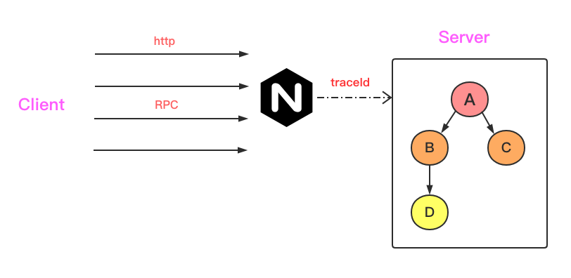

# 概念
- spancontext：保存链路的上下文信息「traceid，spanid，或者是其他想要传递的内容」
- span：链路中的一个操作，存储时间和某些信息
- propagator： trace 传播下游的操作「抽取，注入」
- noop：实现了空的 tracer 实现

## http trac 实现
1. 将 header -> carrier，获取 header 中的traceId等信息
2. 开启一个新的 span，并把「traceId，spanId」封装在context中
3. 从上述的 carrier「也就是header」获取traceId，spanId。
   - 看header中是否设置
   - 如果没有设置，则随机生成返回
4. 从 request 中产生新的ctx，并将相应的信息封装在 ctx 中，返回
5. 从上述的 context，拷贝一份到当前的 request 

## rpc trac 实现
在 rpc 中存在 client, server ，所以从 tracing 上也有 clientTracing, serverTracing 。 serveTracing 的逻辑基本与 http 的一致
1. 获取上游带下来的 span 上下文信息
2. 从获取的 span 中创建新的 ctx，span「继承父span的traceId」
3. 将生成 span 的data加入ctx，传递到下一个中间件，流至下游

go-zero 通过拦截请求获取链路traceID，然后在中间件函数入口会分配一个根Span，然后在后续操作中会分裂出子Span，每个span都有自己的具体的标识，Finsh之后就会汇集在链路追踪系统中。

开发者可以通过 ELK 工具追踪 traceID ，看到整个调用链。同时 go-zero 并没有提供整套 trace 链路方案，开发者可以封装 go-zero 已有的 span 结构，做自己的上报系统，接入 jaeger, zipkin 等链路追踪工具。
