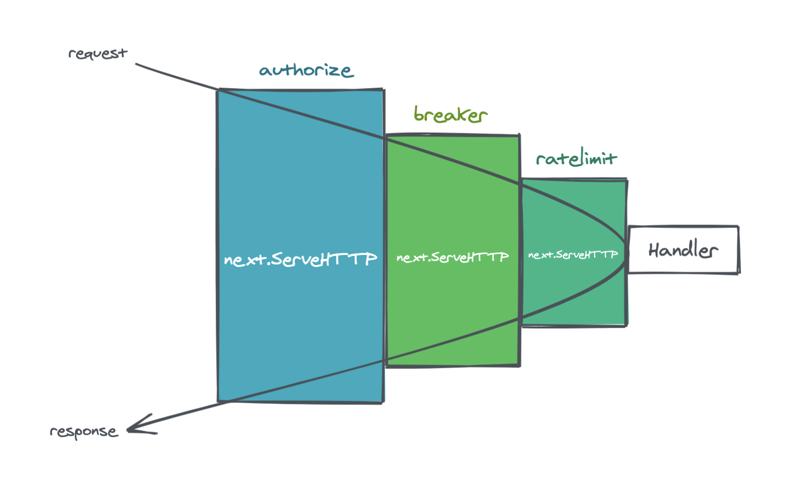

# 文件
以`user/api/user.go`为切入口，阅读源代码
[`code/service/user/api/user.go`](../../code/service/user/api/user.go)

## [原理](https://www.jianshu.com/p/757fb855c349)
### 中间件
web框架中的中间件是实现业务和非业务功能解耦的一种方式，在web框架中我们可以通过中间件来实现诸如鉴权、限流、熔断等等功能，中间件的原理流程如下图： \


rest框架中内置了非常丰富的中间件，在rest/handler路径下，通过alice工具把所有中间件链接起来，当发起请求时会依次通过每一个中间件，当满足所有条件后最终请求才会到达真正的业务Handler执行业务逻辑，上面介绍的jwt鉴权就是通过authHandler来实现的。

### 路由原理
rest框架中通过AddRoutes方法来注册路由，每一个Route有Method、Path和Handler三个属性，Handler类型为http.HandlerFunc，添加的路由会被换成featuredRoutes。

路由数据结构图： \


## `main`方法
1. 从运行命令中获取配置文件信息，配置文件路径默认为`etc/user.yaml`

2. 从文件中读取并填入配置项：`conf.MustLoad(*configFile, &c)` \
详见：[core_conf](core_conf.md) \
   
3. 初始化`gRPC`：`ctx := svc.NewServiceContext(c)` \
详见：[zrpc_client](zrpc_client.md)
   
4. 初始化`restful`：`server := rest.MustNewServer(c.RestConf)` \
详见：[rest_server](rest_server.md)
   
5. `restful`路由注册：按路由配置方法的类别，分别注册 \
   - 代码：`handler.RegisterHandlers(server, ctx)` \
   - `RegisterHandlers`方法中`rest.WithJwt(serverCtx.Config.Auth.AccessSecret)`为路由配置jwt参数，附加相关信息
   - 详见：[rest_server](rest_server.md)
   
## `api/internal/handler`模块
### 文件-[loginhandler.go](../../code/service/user/api/internal/handler/loginhandler.go)
1. 解析请求携带的数据：路径参数、头部、表单、body。
   - 代码：[rest/httpx/requests.go](../rest/httpx/requests.go)

2. 挂载上下文：链路跟踪、请求、RPC
   ```go
       LoginLogic{
           Logger: logx.WithContext(ctx), // 日志 记录请求上下文，便于链路跟踪
           ctx:    ctx, // 请求上下文
           svcCtx: svcCtx, // 服务器上下文，配置 & rpc客户端
       }
   ```

3. 调用`api/internal/logic`相应逻辑处理

4. 将状态码、回复消息写入w：可能成功或失败

### 文件-[logic/loginlogic.go](../../code/service/user/api/internal/logic/loginlogic.go)
1. 调用 `user rpc` 客户端`Login`接口，进行登录，无误则进入下一步，否则返回错误信息
   
2. 账号密码无误，生成 `jwt token` 并返回
