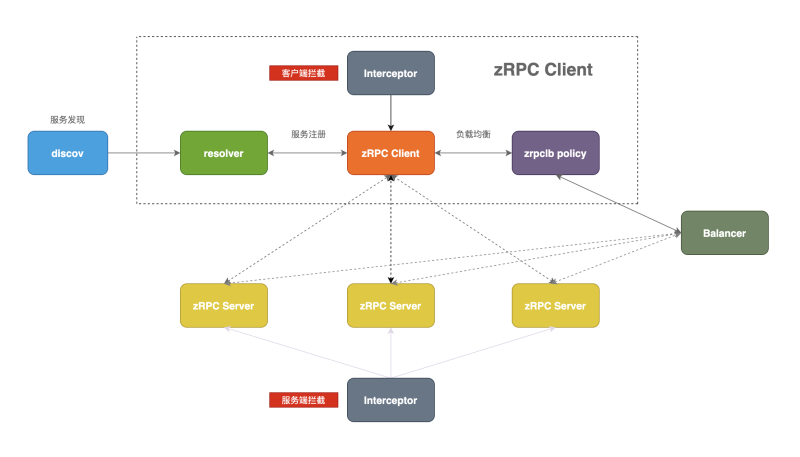
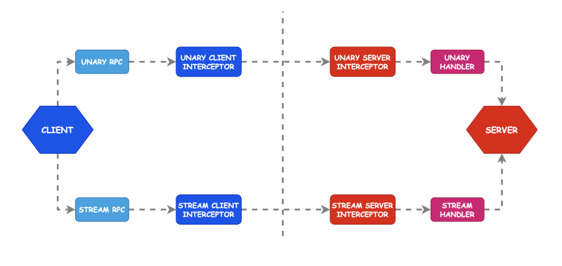
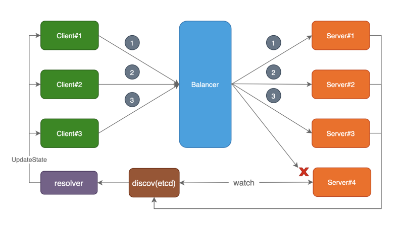

# 文件
以`user/rpc/user.go`为切入口，阅读源代码
[`code/service/user/rpc/user.go`](../../code/service/user/rpc/user.go)

## zRPC原理分析
 \
zRPC主要有以下几个模块组成：
- `discov`: 服务发现模块，基于etcd实现服务发现功能
- `resolver`: 服务注册模块，实现了gRPC的resolver.Builder接口并注册到gRPC
- `interceptor`: 拦截器，对请求和响应进行拦截处理
- `balancer`: 负载均衡模块，实现了p2c负载均衡算法，并注册到gRPC
  - p2c负载均衡算法：首先随机选取两个节点，在这两个节点中选择延迟低，或者连接数小的节点处理请求。
  - 这样兼顾了随机性，又兼顾了机器的性能，实现很简单。
- `client`: zRPC客户端，负责发起请求
- `server`: zRPC服务端，负责处理请求

上述介绍了zRPC的主要组成模块和每个模块的主要功能，其中resolver和balancer模块实现了gRPC开放的接口，实现了自定义的resolver和balancer，拦截器模块是整个zRPC的功能重点，自适应降载、自适应熔断、prometheus服务指标收集等功能都在这里实现

### Interceptor 模块
gRPC提供了拦截器功能，主要是对请求前后进行额外处理的拦截操作，其中拦截器包含客户端拦截器和服务端拦截器，又分为一元(Unary)拦截器和流(Stream)拦截器，这里我们主要讲解一元拦截器，流拦截器同理。 \


zRPC中内置了丰富的拦截器，其中包括自适应降载、自适应熔断、权限验证、prometheus指标收集等等。

当客户端向服务端发起请求，客户端会记录服务端返回的错误，当错误达到一定的比例，客户端会自行的进行熔断处理，丢弃掉一定比例的请求以保护下游依赖，且可以自动恢复。zRPC中自适应熔断遵循《Google SRE》中过载保护策略。

### resolver 模块


当我们启动我们的zRPC Server的时候，调用Start方法，会向etcd中注册对应的服务地址。

当我们启动zRPC客户端的时候，在gRPC内部会调用我们自定义resolver的Build方法，zRPC通过在Build方法内调用执行了resolver.ClientConn的UpdateState方法，该方法会把服务地址注册到gRPC客户端内部。
- 在discov中，通过调用load方法从etcd中获取指定服务的所有地址；
- 通过watch监听服务地址的变化

### balancer 模块


zRPC中自定义了默认负载均衡算法P2C(Power of Two Choices)

注意，zRPC是在客户端进行负载均衡，常见的还有通过nginx中间代理的方式。

zRPC框架中默认的负载均衡算法为P2C，该算法的主要思想是：
1. 从可用节点列表中做两次随机选择操作，得到节点A、B
2. 比较A、B两个节点，选出负载最低的节点作为被选中的节点

主要算法逻辑在 [Pick](../zrpc/internal/balancer/p2c/p2c.go) 方法中实现。

更详细的[注册发现与负载均衡](zrpc_resolver_balancer.md)

### breaker 熔断器
熔断器主要是用来保护调用端，调用端在发起请求的时候需要先经过熔断器，而客户端拦截器正好兼具了这个这个功能，所以在zRPC框架内熔断器是实现在客户端拦截器内。

### 服务自适应降载保护设计
- 计算CPU负载时使用滑动平均来降低CPU负载抖动带来的不稳定，关于滑动平均见参考资料
  - 滑动平均就是取之前连续N次值的近似平均，N取值可以通过超参beta来决定
  - 当CPU负载大于指定值时触发降载保护机制
- 时间窗口机制，用滑动窗口机制来记录之前时间窗口内的QPS和RT(response time)
  - 滑动窗口使用5秒钟50个桶的方式，每个桶保存100ms时间内的请求，循环利用，最新的覆盖最老的
  - 计算maxQPS和minRT时需要过滤掉最新的时间没有用完的桶，防止此桶内只有极少数请求，并且RT处于低概率的极小值，所以计算maxQPS和minRT时按照上面的50个桶的参数只会算49个
- 满足以下所有条件则拒绝该请求
  1. 当前CPU负载超过预设阈值，或者上次拒绝时间到现在不超过1秒(冷却期)。冷却期是为了不能让负载刚下来就马上增加压力导致立马又上去的来回抖动
  2. averageFlying > max(1, QPS*minRT/1e3)
      - averageFlying = MovingAverage(flying)
     - 在算MovingAverage(flying)的时候，超参beta默认取值为0.9，表示计算前十次的平均flying值
     - 取flying值的时候，有三种做法：
       1. 请求增加后更新一次averageFlying，见图中橙色曲线
       2. 请求结束后更新一次averageFlying，见图中绿色曲线
       3. 请求增加后更新一次averageFlying，请求结束后更新一次averageFlying
- QPS = maxPass * bucketsPerSecond
  - maxPass表示每个有效桶里的成功的requests
  - bucketsPerSecond表示每秒有多少个桶
- 1e3表示1000毫秒，minRT单位也是毫秒，QPS*minRT/1e3得到的就是平均每个时间点有多少并发请求


## 代码阅读
### `main`方法
1. 读取并设置配置项

2. 获取数据服务上下文
    ```go
        conn := sqlx.NewMysql(c.Mysql.DataSource) // mysql 连接     
        ServiceContext{
            Config:    c,
              // 注册用户 model（含 持久化-msql & 缓存-redis）
            UserModel: model.NewUserModel(conn, c.CacheRedis),
        }
    ```
   详见：[core_stores.md](core_stores.md)
   
3. 获取`grpc`服务上下文
   ```go
   type UserServer struct {
       svcCtx *svc.ServiceContext
       user.UnimplementedUserServer
   }
   ```
   - 实现：Login、Register、UserInfo服务
   
4. 配置`grpc`服务，传入`grpc`方法注册func
   - 校验 redis 配置
   - 获取运行环境指标对象 metrics，用于监测、降载等
   - 有 etcd 时，在 etcd 注册 grpc 服务（并定时更新）
   - 配置 rpc 服务
   - 配置 rpc 服务拦截器：[自适应负载均衡](https://www.jianshu.com/p/71a3569ed205) 、超时、权限拦截
   - 启动：日志、调测环境配置、链路跟踪、远程监控
   ```go
   rpcServer := &RpcServer{
       server:   server, // rpc 服务对象
       register: register, // rpc 服务方法注册 func 
   }
   ```

## gRPC 注册发现相关
参考：[notes/grpc_intro.md](../../notes/grpc_intro.md)


   
