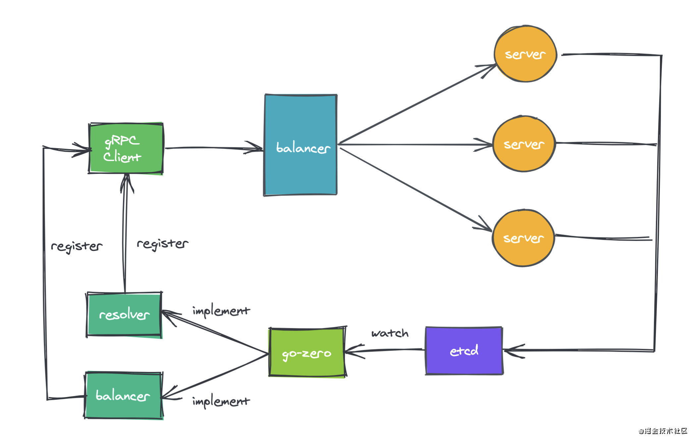
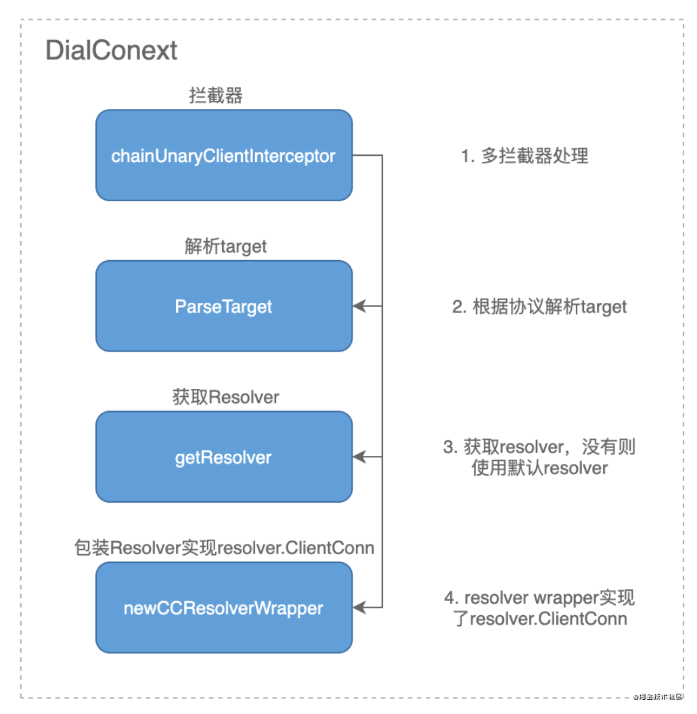
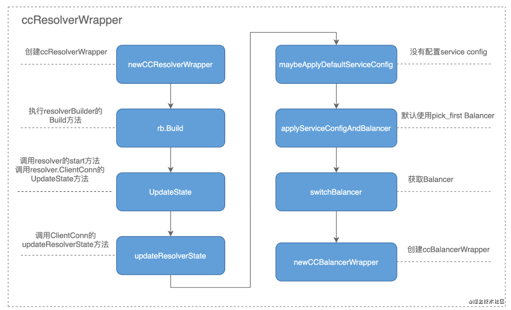
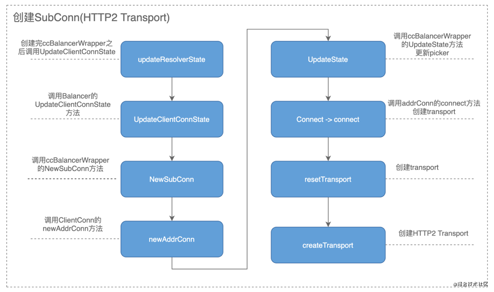
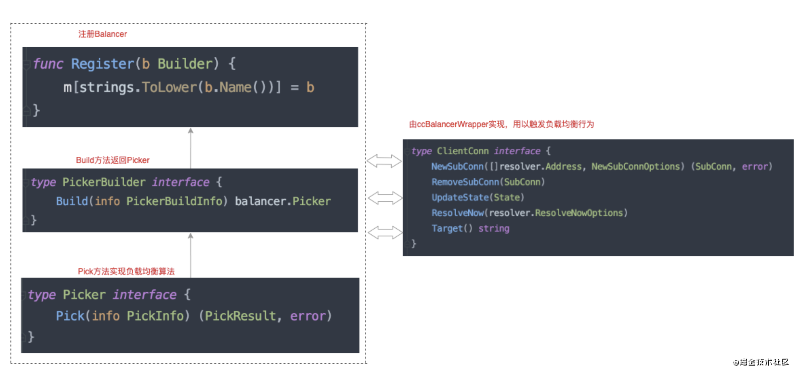
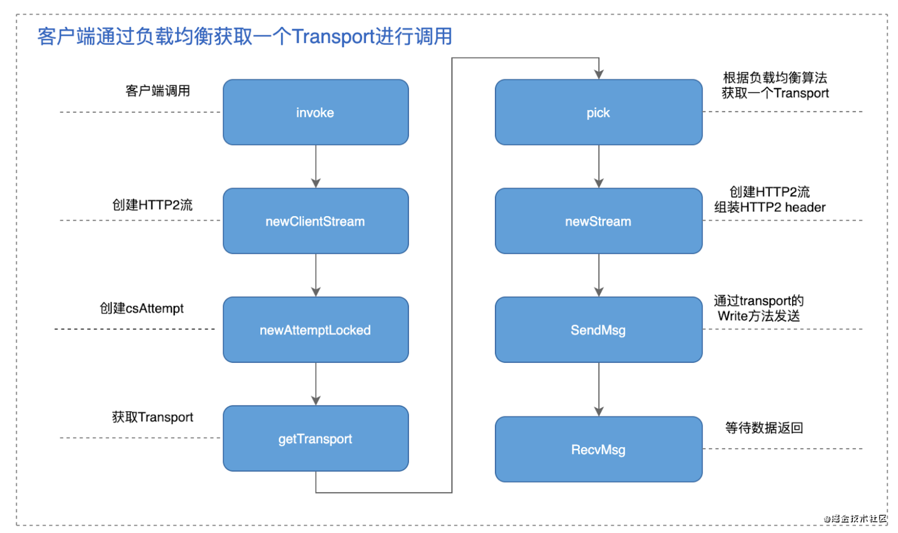

## 基本原理
 \
从图中可以看出go-zero实现了gRPC的resolver和balancer接口，然后通过gprc.Register方法注册到gRPC中，resolver模块提供了服务注册的功能，balancer模块提供了负载均衡的功能。当client发起服务调用的时候会根据resolver注册进来的服务列表，使用注册进来的balancer选择一个服务发起请求，如果没有进行注册gRPC会使用默认的resolver和balancer。服务地址的变更会同步到etcd中，go-zero监听etcd的变化通过resolver更新服务列表。

### Resolver 模块
自定义Resolver需要实现如下步骤：
- 定义target
- 实现resolver.Builder
- 实现resolver.Resolver
- 调用resolver.Register注册自定义的Resolver，其中name为target中的scheme
- 实现服务发现逻辑(etcd、consul、zookeeper)
- 通过resolver.ClientConn实现服务地址的更新

当创建客户端的时候调用DialContext方法创建ClientConn的时候回进行如下操作
- 拦截器处理
- 各种配置项处理
- 解析target
- 获取resolver
- 创建ccResolverWrapper

创建clientConn的时候回根据target解析出scheme，然后根据scheme去找已注册对应的resolver，如果没有找到则使用默认的resolver。 \
 

ccResolverWrapper的流程如下图，在这里resolver会和balancer会进行关联，balancer的处理方式和resolver类似也是通过wrapper进行了一次封装。 \
 

紧着着会根据获取到的地址创建htt2的链接。 \

到此ClientConn创建过程基本结束，我们再一起梳理一下整个过程，首先获取resolver，其中ccResolverWrapper实现了resovler.ClientConn接口，通过Resolver的UpdateState方法触发获取Balancer，获取Balancer，其中ccBalancerWrapper实现了balancer.ClientConn接口，通过Balnacer的UpdateClientConnState方法触发创建连接(SubConn)，最后创建HTTP2 Client。

### Balancer 模块
balancer模块用来在客户端发起请求时进行负载均衡，如果没有注册自定义的balancer的话gRPC会采用默认的负载均衡算法，流程图如下 \

在go-zero中自定义的balancer主要实现了如下步骤：
- 实现PickerBuilder，Build方法返回balancer.Picker
- 实现balancer.Picker，Pick方法实现负载均衡算法逻辑
- 调用balancer.Registet注册自定义Balancer
- 使用baseBuilder注册，框架已提供了baseBuilder和baseBalancer实现了Builer和Balancer

客户端发起调用的流程如下，会调用pick方法获取一个transport进行处理：\

