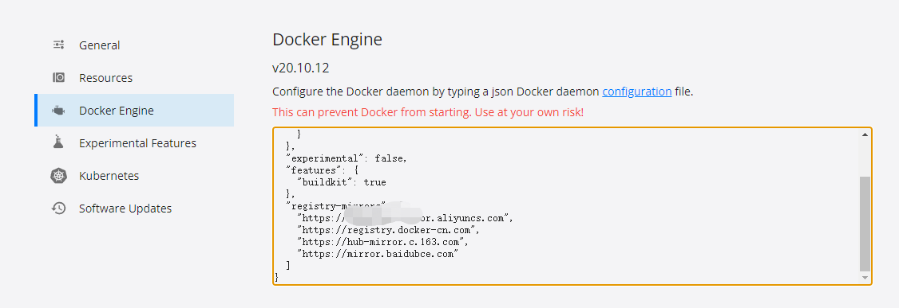
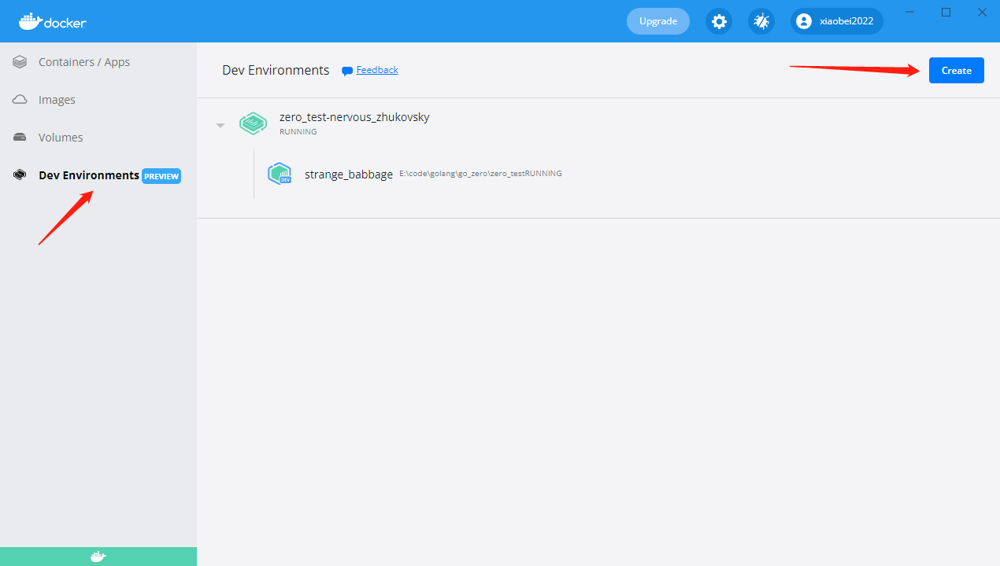
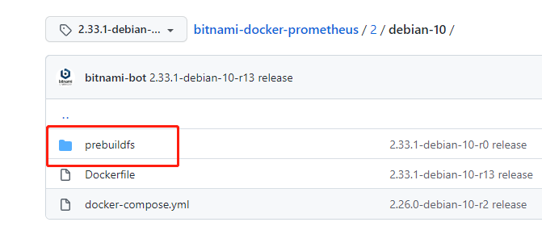
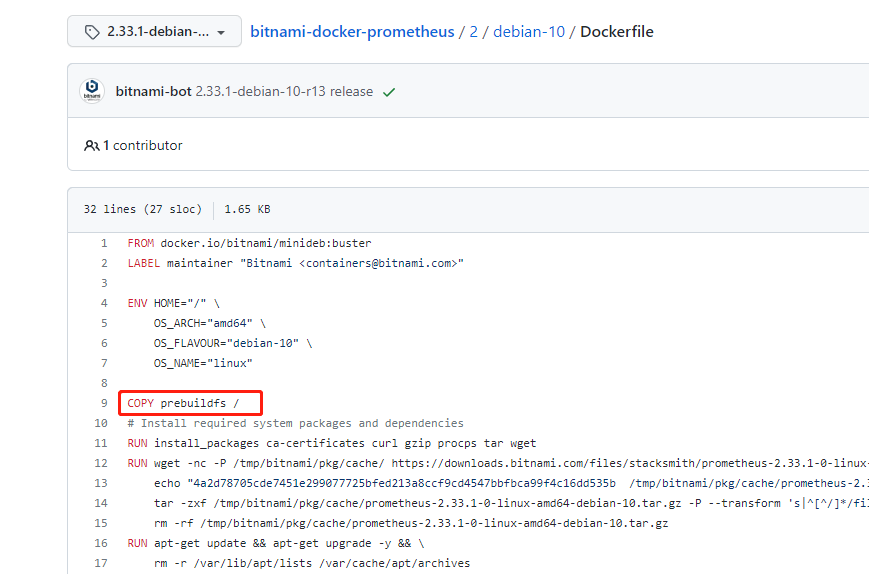

# [环境搭建](https://juejin.cn/post/7054075289579552798)

## 容器运行代理
### 关于问题：
docker pull拉取镜像时使用代理（通过设置设置docker engine、proxies），但容器运行时，dockerfile中wget、curl命令并不走代理

### 临时解决方案：
在dockerfile中配置代理： \
ENV http_proxy "http://192.168.*.*:*" \
ENV https_proxy "http://192.168.*.*:*" \
ENV ftp_proxy "http://192.168.*.*:*" \

但是在其他环境使用该镜像时，需要重置该代理配置，更详细的内容：https://blog.csdn.net/erhaiou2008/article/details/107837344

## 创建项目

### 梗概
1. 在win10创建项目目录
2. 在docker->dev environments选择目录
3. 通过vs code创建并编写dockerfile、.env、docker-compose.yml
4. 从 [GitHub](https://github.com/nivin-studio/gonivinck) 上下载相关dockerfile文件
5. 通过vs code 运行docker-compose.yml（docker compose up）
### 详细
docker运行时的代理设置（区别于镜像）
- ~~在 `resource -> proxies`配置代理~~
  - ~~需要注意的是，这里的代理，是在docker环境中，因此不能用`localhost & 127.0.0.1`来指向win10环境的v2ray代理，而应该使用win10的ip~~
  - ~~如：`192.168.*.*:**`~~

- 镜像代理（即通过`docker pull`命令获取镜像）
  - 在docker -> engine中配置


1. 在电脑创建项目目录
2. 在docker上选择项目目录构建环境


3. ~~下载镜像，如 docker pull golang~~
   - 报错 `dial unix /var/run/docker.sock: connect: permission denied`
   - [解决办法](https://www.cnblogs.com/dakewei/p/12909165.html) ：将当前用户加入docker组 或 修改/var/run/docker.sock的权限
   - 注意，使用`vs code`时，用户名是 `vscode`
4. 依次填写dockerfile、.env、docker-compose.yml
   - 根据docker-compose文件，在相应文件夹下简历Dockerfile文件，仅需参考镜像中提供的dockerfile文件，填写 **from** 内容
     - dockerfile文件内容，如果复制官方的内容，那么，需要注意当前文件是否有引用相对路径的文件，如果有则需要下载相应的文件夹到dockerfile文件处： \
         \
       
   - 在dockerfile中，因github被禁用，curl命令获取github内容，需要使用代理网站：https://ghproxy.com/
 

5. 在vs code上对docker-compose.yml文件右键，docker compose up

## 已知错误
1. prometheus 服务，在docker-compose.yml配置中，配置了 volumes 值，与官方的dockerfile冲突，需要注释，否则会报错

## ~~Todo~~
~~因时间有限，暂时忽略的报错：~~

初步定位为：因代理未配置到位，使得部分命令依赖GitHub上的文件，而无法下载导致的错误。

在配置好代理后，compose up没有出现问题

1. 通过docker-compose安装mysql(5.7版本的dockerfile)
  - 临时解决方案：删去 from以外的内容
```json
executor failed running [/bin/sh -c set -eux;   savedAptMark="$(apt-mark showmanual)";  apt-get update;         apt-get install -y --no-install-recommends ca-certificates wget;         rm -rf /var/lib/apt/lists/*;    dpkgArch="$(dpkg --print-architecture | awk -F- '{ print $NF }')";      wget -O /usr/local/bin/gosu "https://github.com/tianon/gosu/releases/download/$GOSU_VERSION/gosu-$dpkgArch";     wget -O /usr/local/bin/gosu.asc "https://github.com/tianon/gosu/releases/download/$GOSU_VERSION/gosu-$dpkgArch.asc";     export GNUPGHOME="$(mktemp -d)";        gpg --batch --keyserver hkps://keys.openpgp.org --recv-keys B42F6819007F00F88E364FD4036A9C25BF357DD4;    gpg --batch --verify /usr/local/bin/gosu.asc /usr/local/bin/gosu;        gpgconf --kill all;     rm -rf "$GNUPGHOME" /usr/local/bin/gosu.asc;    apt-mark auto '.*' > /dev/null;         [ -z "$savedAptMark" ] || apt-mark manual $savedAptMark > /dev/null;     apt-get purge -y --auto-remove -o APT::AutoRemove::RecommendsImportant=false;   chmod +x /usr/local/bin/gosu;    gosu --version;         gosu nobody true]: exit code: 5
ERROR: Service 'mysql' failed to build : Build failed
The terminal process "/bin/bash '-c', 'docker-compose -f "docker-compose.yml" up -d --build'" terminated with exit code: 1.
```

2. 同1 redis:5.0
```json
executor failed running [/bin/sh -c set -eux;   savedAptMark="$(apt-mark showmanual)";  apt-get update;         apt-get install -y --no-install-recommends ca-certificates dirmngr gnupg wget;   rm -rf /var/lib/apt/lists/*;    dpkgArch="$(dpkg --print-architecture | awk -F- '{ print $NF }')";       wget -O /usr/local/bin/gosu "https://github.com/tianon/gosu/releases/download/$GOSU_VERSION/gosu-$dpkgArch";    wget -O /usr/local/bin/gosu.asc "https://github.com/tianon/gosu/releases/download/$GOSU_VERSION/gosu-$dpkgArch.asc";     export GNUPGHOME="$(mktemp -d)";        gpg --batch --keyserver hkps://keys.openpgp.org --recv-keys B42F6819007F00F88E364FD4036A9C25BF357DD4;    gpg --batch --verify /usr/local/bin/gosu.asc /usr/local/bin/gosu;        gpgconf --kill all;     rm -rf "$GNUPGHOME" /usr/local/bin/gosu.asc;    apt-mark auto '.*' > /dev/null;         [ -z "$savedAptMark" ] || apt-mark manual $savedAptMark > /dev/null;     apt-get purge -y --auto-remove -o APT::AutoRemove::RecommendsImportant=false;   chmod +x /usr/local/bin/gosu;    gosu --version;         gosu nobody true]: exit code: 4
ERROR: Service 'redis' failed to build : Build failed
The terminal process "/bin/bash '-c', 'docker-compose -f "docker-compose.yml" up -d --build'" terminated with exit code: 1.
```