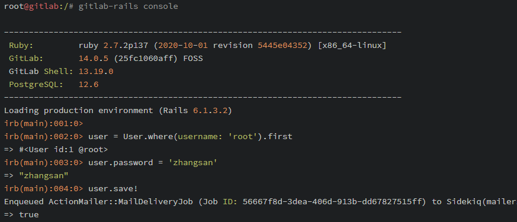

# GitLab安装
创建文件夹，编写`docker-compose.yml`文件
```yaml
version: '3.5'
# 网络配置
networks:
  backend:
    driver: ${NETWORKS_DRIVER}

# 服务容器配置
services:
  gitlab:                                # 自定义容器名称
    build:
      context: ./gitlab                  # 指定构建使用的 Dockerfile 文件
    environment:                         # 设置环境变量
      - TZ=${TZ}
    volumes:                             # 设置挂载目录
      - ${GITLAB_PATH_CONFIG}:/etc/gitlab  # 引用 .env 配置 挂载宿主机目录给gitlab镜像使用
      - ${GITLAB_PATH_LOG}:/var/log/gitlab  # 引用 .env 配置
      - ${GITLAB_PATH_DATA}:/var/opt/gitlab  # 引用 .env 配置
    ports:                               # 设置端口映射
      - "443:443"                      # 443是暴露给宿主机的端口
      - "8080:80"                      # 8080是暴露给宿主机的端口
      - "22:22"
    networks:
      - backend
    restart: always                      # 指定容器退出后的重启策略为始终重启
```

创建`gitlab`文件夹，编写`Dockerfile`文件
```dockerfile
# 镜像及版本号（最新稳定版）
FROM gitlab/gitlab-ce:latest
# 所有者
LABEL maintainer=Lusifer<topsale@vip.qq.com>
```

创建docker dev environment

docker compose up

开启服务后，需要配置root密码，然后批准新注册用户

重置root账号（在`gitlab`容器中进行）
 - `gitlab-rails console`
 - `user = User.where(username: 'root').first`
 - `user.password = 'zhangsan'`
 - `user.save!`

   
使用参考：https://go-zero.dev/cn/service-deployment.html
